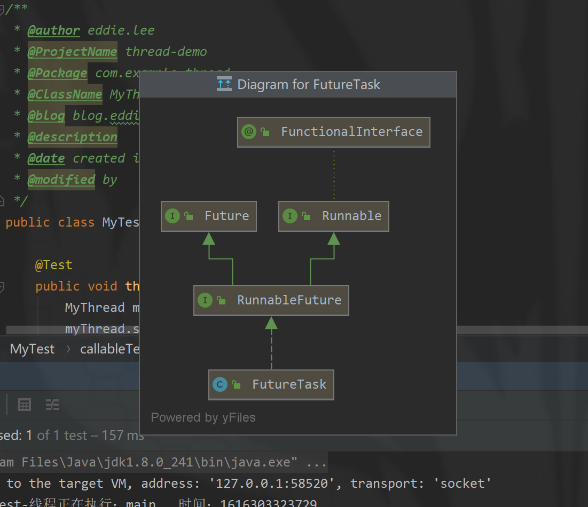

[TOC]

# 目录

## （一）线程创建

### 1.1 线程创建-继承thread类

#### 1.1.1 创建自定义线程类

```java
public class MyThread extends Thread {

	private Integer MAX_VALUE = 10;

	@Override
	public void run() {
		for (int i = 0; i < MAX_VALUE; i++) {
			System.out.println("MyThread线程正在执行：" + currentThread().getName() + " , 时间：" + System.currentTimeMillis());
		}
	}
}
```

#### 1.1.2 单元测试
```java
public class MyThreadTest {

	@Test
    public void threadTest() {
		MyThread myThread = new MyThread();
		myThread.start();
		int MAX_VALUE = 10;
		for (int i = 0; i < MAX_VALUE; i++) {
			System.out.println("MyThreadTest线程正在执行：" + Thread.currentThread().getName() + " , 时间：" + System.currentTimeMillis());
		}
	}
}
```

#### 1.1.3 Console
```text
MyThreadTest线程正在执行：main , 时间：1616254510778
MyThreadTest线程正在执行：main , 时间：1616254510778
MyThreadTest线程正在执行：main , 时间：1616254510778
MyThreadTest线程正在执行：main , 时间：1616254510778
MyThreadTest线程正在执行：main , 时间：1616254510778
MyThreadTest线程正在执行：main , 时间：1616254510778
MyThreadTest线程正在执行：main , 时间：1616254510778
MyThread线程正在执行：Thread-0 , 时间：1616254510778
MyThreadTest线程正在执行：main , 时间：1616254510778
MyThread线程正在执行：Thread-0 , 时间：1616254510779
MyThreadTest线程正在执行：main , 时间：1616254510779
MyThread线程正在执行：Thread-0 , 时间：1616254510779
MyThreadTest线程正在执行：main , 时间：1616254510779
MyThread线程正在执行：Thread-0 , 时间：1616254510779
MyThread线程正在执行：Thread-0 , 时间：1616254510779
MyThread线程正在执行：Thread-0 , 时间：1616254510779
MyThread线程正在执行：Thread-0 , 时间：1616254510779
MyThread线程正在执行：Thread-0 , 时间：1616254510779
MyThread线程正在执行：Thread-0 , 时间：1616254510779
MyThread线程正在执行：Thread-0 , 时间：1616254510779
Disconnected from the target VM, address: '127.0.0.1:56459', transport: 'socket'

Process finished with exit code 0
```

### 1.2 线程创建-实现Runnable接口

#### 1.2.1 创建自定义类实现Runnable接口
```java
public class MyRunnable implements Runnable {

	public void run() {
		int maxvalue = 10;
		for (int i = 0; i < maxvalue; i++) {
			System.out.println("MyRunnable线程正在执行：" + Thread.currentThread().getName() + " , 时间：" + System.currentTimeMillis());
		}
	}
}
```

#### 1.2.2 单元测试
```java
@Test
public void runnableTest() {
    Thread thread = new Thread(new MyRunnable());
    thread.start();
    int MAX_VALUE = 10;
    for (int i = 0; i < MAX_VALUE; i++) {
        System.out.println("runnableTest-线程正在执行：" + Thread.currentThread().getName() + " , 时间：" + System.currentTimeMillis());
    }
}
```

#### 1.2.3 Console
```text
Connected to the target VM, address: '127.0.0.1:58211', transport: 'socket'
runnableTest-线程正在执行：main , 时间：1616302606499
runnableTest-线程正在执行：main , 时间：1616302606499
runnableTest-线程正在执行：main , 时间：1616302606499
runnableTest-线程正在执行：main , 时间：1616302606499
MyRunnable线程正在执行：Thread-0 , 时间：1616302606499
runnableTest-线程正在执行：main , 时间：1616302606499
MyRunnable线程正在执行：Thread-0 , 时间：1616302606499
runnableTest-线程正在执行：main , 时间：1616302606500
MyRunnable线程正在执行：Thread-0 , 时间：1616302606500
runnableTest-线程正在执行：main , 时间：1616302606500
MyRunnable线程正在执行：Thread-0 , 时间：1616302606500
runnableTest-线程正在执行：main , 时间：1616302606500
MyRunnable线程正在执行：Thread-0 , 时间：1616302606500
runnableTest-线程正在执行：main , 时间：1616302606500
MyRunnable线程正在执行：Thread-0 , 时间：1616302606500
runnableTest-线程正在执行：main , 时间：1616302606500
MyRunnable线程正在执行：Thread-0 , 时间：1616302606500
MyRunnable线程正在执行：Thread-0 , 时间：1616302606500
MyRunnable线程正在执行：Thread-0 , 时间：1616302606500
MyRunnable线程正在执行：Thread-0 , 时间：1616302606500
Disconnected from the target VM, address: '127.0.0.1:58211', transport: 'socket'
```

### 1.3 线程创建-实现Callable接口

#### 1.3.1 创建自定义类实现Callable接口
```java
public class MyCallable implements Callable<String> {

	public String call() throws Exception {
		int maxvalue = 10;
		for (int i = 0; i < maxvalue; i++) {
			System.out.println(
					"MyCallable线程正在执行：" + Thread.currentThread().getName() + " , 时间：" + System.currentTimeMillis()
            );
		}
		return "MyCallable Finished！";
	}
}
```

#### 1.3.2 单元测试
```java
@Test
public void callableTest() throws ExecutionException, InterruptedException {
    FutureTask futureTask = new FutureTask(new MyCallable());
    Thread thread = new Thread(futureTask);
    thread.start();
    int MAX_VALUE = 10;
    for (int i = 0; i < MAX_VALUE; i++) {
        System.out.println("callableTest-线程正在执行：" + Thread.currentThread().getName() + " , 时间：" + System.currentTimeMillis());
    }
    System.out.println(futureTask.get());
}
```

#### 1.3.3 Console
```text
callableTest-主线程正在执行：main , 时间：1616333190254 , 循环次数：0
callableTest-主线程正在执行：main , 时间：1616333190254 , 循环次数：1
callableTest-主线程正在执行：main , 时间：1616333190255 , 循环次数：2
callableTest-主线程正在执行：main , 时间：1616333190255 , 循环次数：3
callableTest-主线程正在执行：main , 时间：1616333190255 , 循环次数：4
callableTest-主线程正在执行：main , 时间：1616333190255 , 循环次数：5
callableTest-主线程正在执行：main , 时间：1616333190255 , 循环次数：6
callableTest-主线程正在执行：main , 时间：1616333190255 , 循环次数：7
callableTest-主线程正在执行：main , 时间：1616333190255 , 循环次数：8
MyCallable线程正在执行：callableTest , 时间：1616333190255 , 循环次数：0
callableTest-主线程正在执行：main , 时间：1616333190255 , 循环次数：9
MyCallable线程正在执行：callableTest , 时间：1616333190255 , 循环次数：1
MyCallable线程正在执行：callableTest , 时间：1616333190255 , 循环次数：2
MyCallable线程正在执行：callableTest , 时间：1616333190255 , 循环次数：3
MyCallable线程正在执行：callableTest , 时间：1616333190255 , 循环次数：4
MyCallable线程正在执行：callableTest , 时间：1616333190255 , 循环次数：5
MyCallable线程正在执行：callableTest , 时间：1616333190255 , 循环次数：6
MyCallable线程正在执行：callableTest , 时间：1616333190255 , 循环次数：7
MyCallable线程正在执行：callableTest , 时间：1616333190255 , 循环次数：8
MyCallable线程正在执行：callableTest , 时间：1616333190255 , 循环次数：9
MyCallable Finished！
Disconnected from the target VM, address: '127.0.0.1:50517', transport: 'socket'

Process finished with exit code 0
```

#### 1.3.4 FutureTask的用法及两种常用的使用场景
>FutureTask可用于异步获取执行结果或取消执行任务的场景。通过传入Runnable或者Callable的任务给FutureTask，直接调用其run方法或者放入线程池执行，之后可以在外部通过FutureTask的get方法异步获取执行结果，因此，FutureTask非常适合用于耗时的计算，主线程可以在完成自己的任务后，再去获取结果。另外，FutureTask还可以确保即使调用了多次run方法，它都只会执行一次Runnable或者Callable任务，或者通过cancel取消FutureTask的执行等。

FutureTask类结构如下：

